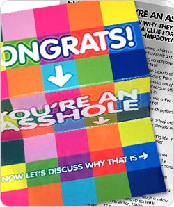
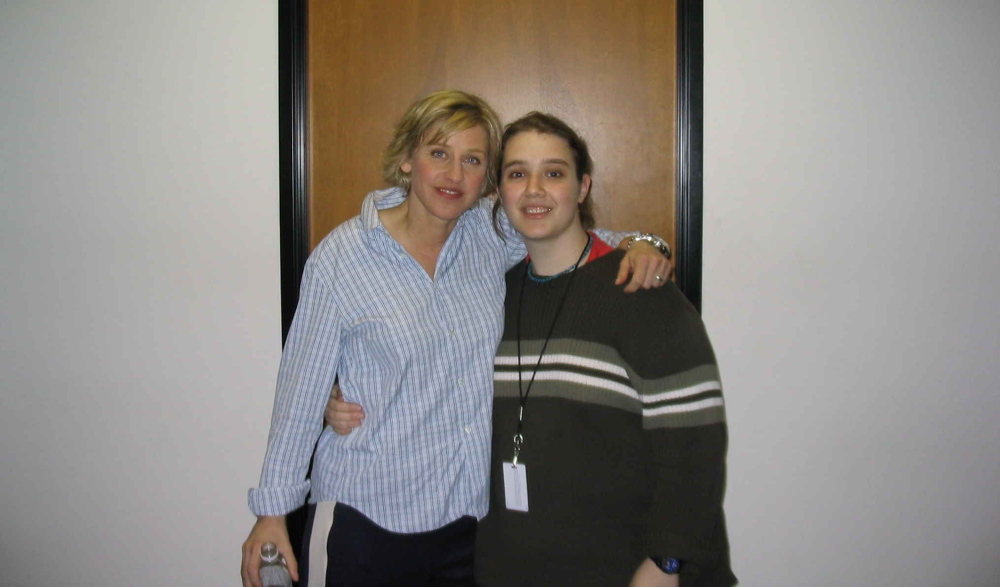
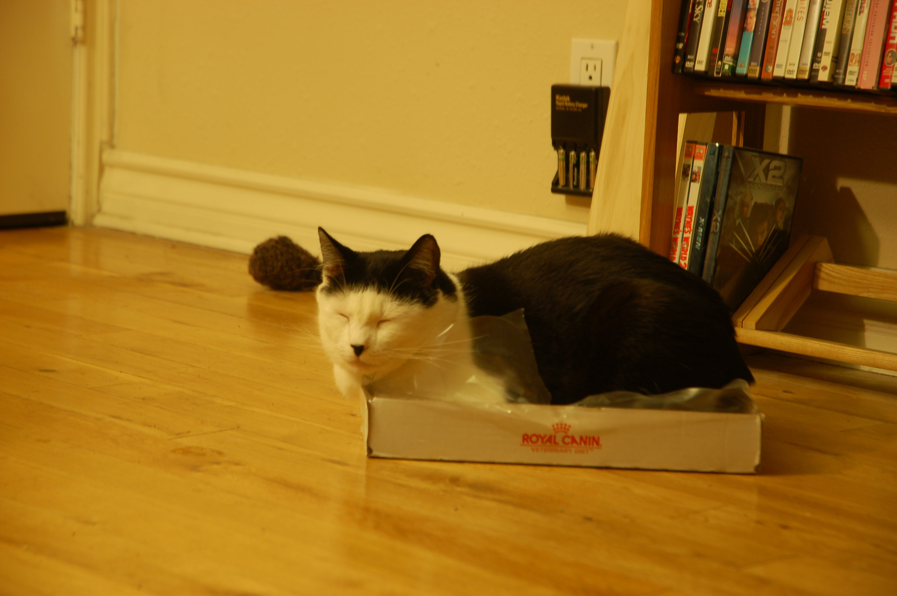
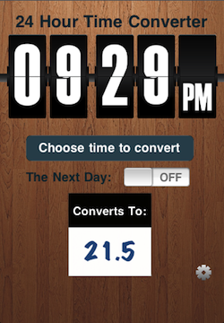
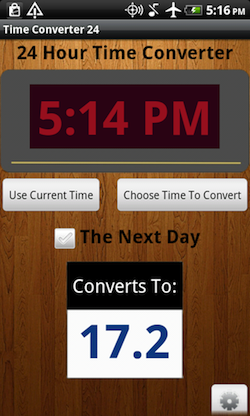
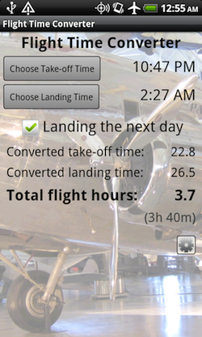
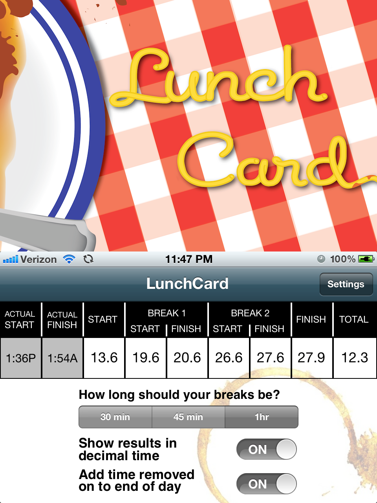

#[fit]_**Starting**_ Over
#[fit]_**by Ellen Shapiro**_ RWDevCon _**Washington DC**_ February 2015

^We've all had times in our life were we wonder in frustration, "How did I wind up here?"

^Maybe you're working a job that drives you bananas, or a living in a city or with a person that just isn't the right fit, or maybe the industry you started out in is turning into a burnt-out husk of its former self.

^What I'm talking about isn't something where you get transferred, or your significant others gets transferred, or some other force comes along and makes the decision to start over for you. 

^This is something where you drive the decision-making process. *You* decide to start over. 

^Just the mere mention of starting over makes some people cringe. And I don't blame them - starting over voluntarily is terrifying.

---
Courtesy https://www.flickr.com/photos/sam-_-/5509313917

^If you're starting over professionally, you go from being someone with lots of experience in your field to someone with *zero* experience in your field.  

^If you're starting over personally, you can wind up in a city, a state, or even a country where you don't know anyone. 

^But I'm here today to tell you that some of the things that make you fear starting over are myths. If you let yourself be paralyzed by the fears these myths create, you can miss out on a fantastic new chapter in your life. 

^Yes, starting over is scary. But it's not as scary as you think. 

---

#[fit]My _**Story**_

^I want to start by telling you my story. I've gone through three major phases in my life, all of them pretty different from the previous one: I was a songwriter, I worked in Television Production, and now I'm an iOS Engineer. 

^Every time I made one of these huge changes, it was incredibly scary. But I did it, and I learned a lot of things along the way. I want to share some of my story with you:

---

#[fit]My _**Story**_
#[fit]\(A tale of _**three**_ careers)

^I call it A Tale of Three Careers. So let's go back to a magical time known as: The 1990's!

---

#[fit]Career #1: _**Songwriter**_

^My first career was as a songwriter. 

^I started playing the guitar when I was ten years old. I started writing songs when I was twelve. By the time I was eighteen, I had a couple regular gigs here in my hometown of DC. 

^All I wanted was to be the next Sheryl Crow, or the next Melissa Etheridge. And I poured tons of energy into songwriting. 

^I took all the money I'd gotten at my bat mitzvah and combined it with a couple years' worth of allowance, and I put out an album just before my 18th birthday.

---

^You can still listen to it on Rdio or Spotify - it's called Bridge Over Bottled Water. I will warn you that my lyrics contain a heaping helping of teenage angst, because, well, I was a teenager. But I am still incredibly proud of that album. 

^Even after I went to college in Chicago, I spent an enormous amount of my free time playing and writing. 

^I started to pull together a little bit of success. I got my first showcase at a big music conference, and I started to book some bigger gigs in Chicago. 

---

^But as I started to pour myself into the work it took to become a successful working musician, I realized: This is going to make me absolutely hate music. 

^It wasn't the musicians I played with - they were great - but so many of the people that I dealt with around the music business were, to put it very mildly, colossal assholes.

---

^They treated everyone around them like dirt at best, and the toxic attitude they projected seemed to get exponentially worse as you got even incrementally more successful. 

^You had to really, really, really love music to keep loving it after coming into contact with these people. And not loving music anymore was not a possibility I was willing to accept. I finally realized: Doing this professionally is not for me. 

^This was a really terrifying realization. I'd built my entire social identity around being a songwriter, and I'd poured years of effort and thousands of dollars into trying to make a go of being a professional. 

^How was I going to move forward from that? 

---

###[fit]Career #2: _**TV Nerd**_

^My second career in television production actually started as a result of my interest in music being so strong: My parents had been generous enough to pay for my education on the condition that I study something *other* than music. 

^I had realized that film school could actually be a great way to learn about audio engineering, and pick up some practical, creative skills that easily transferred back to music. 

^Once I decided a career in music wasn't going to be for me, I found that I was still really enjoying working with sound in a more filmic fashion. 

---

###[fit]Career #2: _**TV Nerd**_

^I was the sound recordist during shooting or the post-production sound editor on several films that my friends directed. I had a lot of fun, and I learned a lot about how to make things sound really great. 

^In September of 2003, I moved out to Los Angeles to try and break into the business. When the timing for purely audio-based internships didn't work out, I started applying for internships at anything that looked remotely interesting. I got a bite from a new talk show that had only been on the air for six weeks. 

---

^I wound up working for the Ellen DeGeneres show for almost two years, and I loved it. I also worked at House for two years, on a show called Trust Me for 6 months...

---
 

^and then I worked a large number of failed pilots. 

^Pilots are the first episode of a TV show, and if the network likes the pilot, it becomes a TV show. If the network doesn't like the pilot or for any of a million other reasons, the pilot fails, and it's essentially locked away in a vault, never to be seen again.

^The failed pilots were the hardest. As a crew, we would all work ourselves into the ground trying to help make something good,

---
 

#[fit]nope

^and then *poof* - it was like all that work had disappeared into thin air. 

^No one would ever see what we made. If you've ever had a client pull the plug a good ways into a project, you know exactly how this feels.

^I finally got so frustrated with this happening over and over again that I realized that I had completely lost my passion for what I was doing - and if you're not passionate about what you're doing, the entertainment industry can really crush your soul. 

^I knew I was going to have to start over *again*. And this time, it was a lot scarier: I had absolutely no idea what I was going to be able to transfer the very industry-specific skills I had picked up over to something completely different. I also had rent to pay.  

---

^I had to feed myself and my cat, who you can see here, in that apartment I didn't know how to pay for, sitting in a box of his expensive prescription food. And for a while, I couldn't even decide what I wanted to do. 

^But then I noticed that during my downtime, while my friends were off writing screenplays or shooting YouTube videos, I was trying to figure out how my phone worked. And I realized: Maybe this is what I should actually be doing. 

---

###[fit]Career #3: _**Actual Nerd**_

^For my third career, I decided to be a professional nerd. I'd always been good at tech stuff, at least in comparison to the rest of the entertainment business: When I first started at Ellen, I was the only person who knew how to hook up a Mac to a networked printer. 

^As I moved from show to show, people started to figure out that I was often a reasonable substitute for calling IT. I was good enough at IT stuff that I put together a decent side business fixing computer and networking issues for writers, producers, and other people with more money than time. 

---

` `
` `
` `
` `
` `
` `
` `
` `
` `
` `
` `
` `

Courtesy https://www.flickr.com/photos/emagic/51069522

^I knew I could easily go into IT professionally. But I wanted something more challenging. I realized I didn't want to be fixing other people's mistakes: I wanted to be making my own. 

^And I was so fascinated by smartphones and their inherent potential that I knew, I just *knew* I had to learn how they worked. 

^I found a program at UCLA Extension that quickly taught me the basics of Object-Oriented programming, and showed me how to make very rudimentary iPhone and Android apps. And that confirmed to me: This is what I want to do. 

---

    
 
^I kept building stuff. I made three iOS apps and two Android apps on my own. It was hard, especially back in the dark ages of 2011. I found RayWenderlich.com, and I inhaled tutorials from the site like air. 

^I even got a job and moved back to Chicago. I kept learning. I worked every spare second I had to keep getting better, and I continue to do that every single day. 

---

^Four years after I first learned how to program, I'm speaking about how to do it, and I'm building tools and writing tutorials to make it easier for other people to learn. 

---

#[fit]What did I _**learn**_? 
#[fit]How can _**you**_ use it? 

^So now that you've heard what is essentially my entire life story, I want to try and take some of the lessons I learned and make them actionable. I want to share the five most important things I learned from starting over...and over. 

---

#[fit]1.
#[fit]The thing that you're 
#[fit]passionate about can
#[fit]_**change**_, and _**that's OK**_

^You always hear all sorts of advice about following your passion. And this is really easy if the thing you are passionate about is easy to get into, and pays a zillion dollars. 

^It's a lot harder if the thing you're passionate about is difficult, if it puts a mental or financial strain on you or your family, or if you are working against any kind of entrenched system that tells you that for whatever reason, your work is not good enough. 

^And the fact of the matter is the thing that you were passionate about at 10, the thing that you're passionate about at 22, the thing you're passionate about at 40, and the thing you're passionate about at 65 can be very different. 

---

#[fit]1.
#[fit]The thing that you're 
#[fit]passionate about can
#[fit]_**change**_, and _**that's OK**_

^If you are doing something because you are passionate - not just because you want to make a buck - you have to constantly challenge that passion. Life is short and the time to make an impact can be even shorter if you need good health to do it. You have to ask yourself the hard question: "Is this still what I want to do with my life?" 

^Failing to ask that question, and ask it regularly, can lead to years of dissatisfaction, because you're doing what you dreamed of doing, but you don't realize that the dream belonged to a different version of you. 

---

#[fit]1.
#[fit]The thing that you're 
#[fit]passionate about can
#[fit]_**change**_, and _**that's OK**_

^The answer to "Is this still what I want to do with my life?" can remain yes for a long time. Simply asking that question is an incredibly helpful way to keep pushing yourself to work on the things you're most passionate about, and make the most out of your life.

^But you also have to be okay with the answer to that question being "No". 

^You have to be willing to use that response as a jumping-off point to figure out, "Well, what *do* I want to do with my life?"

---

#[fit]2. 
#[fit]Making _**lemonade out of lemons**_
#[fit] is a necessity

^When you get to the point where you realize that no, you're not doing what you want to be doing with your life, you can feel like life handed you a lemon. 

^In my case, this happened both literally and figuratively -

---

^This is a lemon that almost hit me in the head when I was walking home from the gym one day.

^Anytime you have a setback, it sucks. It's frustrating. It's like almost getting in the head with a gigantic lemon. 

^You have to be able to look at a setback, and say: "Well, that sucked, but it happened and I can't change that. How can I move forward from here?" 

---

^If you spend all your time looking at the lemon that hit you, lamenting how heavy or how sour it is, thinking about how much better it would be if it were an orange, you're not able to look at the opportunities the lemon itself provides. 

^But if you say, OK, I've got this gigantic lemon, what on earth am I going to do with this? Well, sometimes you can wind up with a lot of delicious lemonade. 

---

  

^In the literal case, one giant lemon can make more than half a gallon of lemonade. 

^In the figurative case, I'd originally intended to go get a Masters in Computer Science. But I quickly realized that I was not academically qualified to do this, and to get academically qualified was going to take me years, if it could be done at all. I was crushed for a while after I found this out. 

---

  

^Then I realized moping was going to do me as much good as staring at a lemon, wishing it were lemonade - I had to regroup. I did some research and found the more professionally targeted UCLA Extension program. 

^And I realized, well, I have this lemon of not being able to get a Masters in Computer science. But I have this other opportunity that could let me be a working software engineer significanlty faster. 

^The figurative lemonade has been my entire career as an iOS developer.

---

#[fit]3.
#[fit]_**Change**_ Is _**Not**_ 
#[fit]An Admission Of _**Failure**_

^This one may not apply to everyone, but for those who it does apply to, it's a huge one. 

^I was raised to be terrified of failure. I was a go-getter, a grade-grubber, a goody-two-shoes, and about 40 other synonyms for total nerd. 

^A B grade in school meant I was slacking. The couple times I got a C, it was as if the world had fallen apart, broken until that got pushed back up to at least an A-. 

^I'd always been raised with the idea that if I tried hard enough, I could make anything happen. 

---

#[fit]3.
#[fit]_**Change**_ Is _**Not**_ 
#[fit]An Admission Of _**Failure**_

^Part of why I was so terrified of starting over was the implicit acknowledgement that what I had been trying before just wasn't working, no matter how hard I'd tried. I thought it was admitting that I had failed. 

^It took the benefit of hindsight to realize that it wasn't an admission of failure: It was an admission that what I had been trying before wasn't for me. 

^When I released myself from the expectation that I had to succeed at every single thing I tried, starting over on a different thing became far, far easier. 

---

#[fit]4.
#[fit]You never know
#[fit] what _**transfers**_

^When I worked in the TV industry, I had to deal with a lot of...big personalities. People who wanted things the way they wanted things, and wanted them that way *yesterday*. 

^From working with these people, I learned the absolutely critical nature of expectation-setting.

^For the demanding people I worked for, if you told them something was going to happen to make them happy, and then it did not happen, they were *furious*. 

---

#[fit]4.
#[fit]You never know
#[fit] what _**transfers**_

^But if you told them the incremental steps that were going to happen, and didn't overcommit, they were always happy - they were informed about what was happening, and they could see visible progress. 

^I haven't dealt with anyone nearly as nuts in tech as some folks I dealt with in the entertainment industry. But anyone who's done client work is probably nodding along in agreement right now. 

---

#[fit]4.
#[fit]You never know
#[fit] what _**transfers**_

^That technique I learned to cope with working for total looney tunes proved highly, highly useful in simply dealing with businesses who need to make decisions based on the schedule you give them. 

^You will find that when you start over that you have skills that transfer over in completely unexpected ways. The things you learn that you think are completley specific to your industry, *especially* when dealing with people, can help you out immensely. 

^And finally, this leads into the most important thing I learned: 

---

#[fit]5. 
#[fit]You can learn
#[fit]_**anything**_ as long as
#[fit]you _**know how to learn**_

^One of the things that always terrified me about starting over was the idea that I would be "throwing away" everything that I'd learned about the thing I'd already been doing.

^I mean, how did knowing how to tune a guitar apply to ordering film? How did knowing how to find a 30' Technocrane a day before you were supposed to shoot transfer to building a drop-in UIPopoverController replacement? 

^But what I realized was that in all of my attepmted careers, I'd learned how to research things. 

---

#[fit]5. 
#[fit]You can learn
#[fit]_**anything**_ as long as
#[fit]you _**know how to learn**_

^I learned how to word Google searches precisely enough that I could get it to give me back *exactly* what I was looking for, whether it was how to play a song on the guitar, how to install a firmware update for a particular windows machine, or the exact wording of a super long UIGestureRecognizerDelegate method.

^When I started programming, I was already miles and miles ahead of other people in my classes because I could coax useful information out of the Apple and Android docs, StackOverflow, and other online resources far more efficiently. 

----

^The power of learning has become newly clear with Swift. We've all had to start over again - to come from a very traditionally object-oriented language to a more functional one. And learning an entire new syntax, one that sometimes requires us each to tie our pinkies to our ring fingers to keep from typing semicolons, has been hard. 

^But if you've learned how to *learn*, and not just how to do one specific thing, you can do it. And we will do it. And I, for one, am so, so excited to do it. 

----

^In conclusion, I hope I've inspired you all to challenge your passion, and to remember that you know so much more than you realize, and can learn even more. So next time you wonder "How in the heck did I end up here?", I hope you too can remember to not see change as a failure, and to make lemons out of lemonade.

^Because the fact of the matter is that while: 

---
#[fit]Starting over can be 
#[fit]_**terrifying**_ 

---

#[fit]It's _**also**_ 
#[fit]the most _**exciting**_ 
#[fit]thing in the world.

---

#[fit]\[ _**thank you!**_ ]